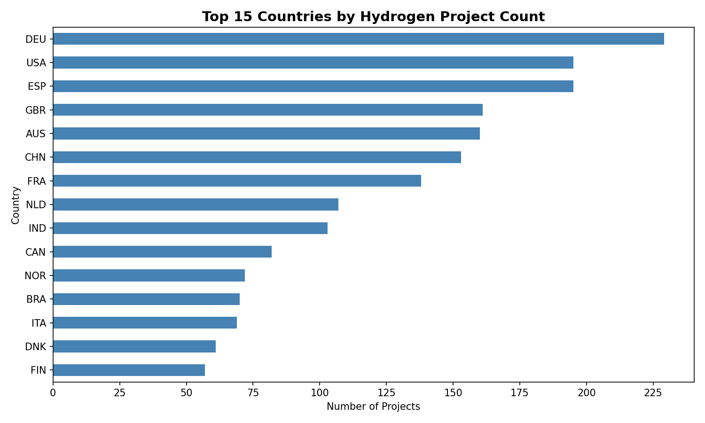
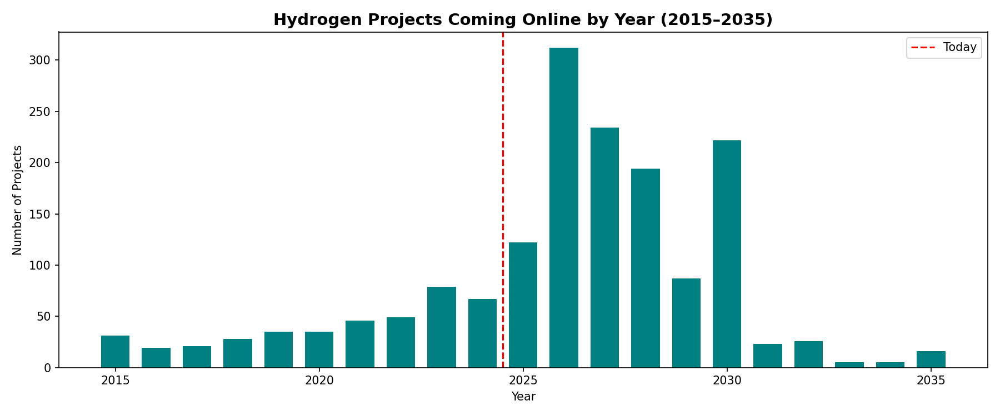
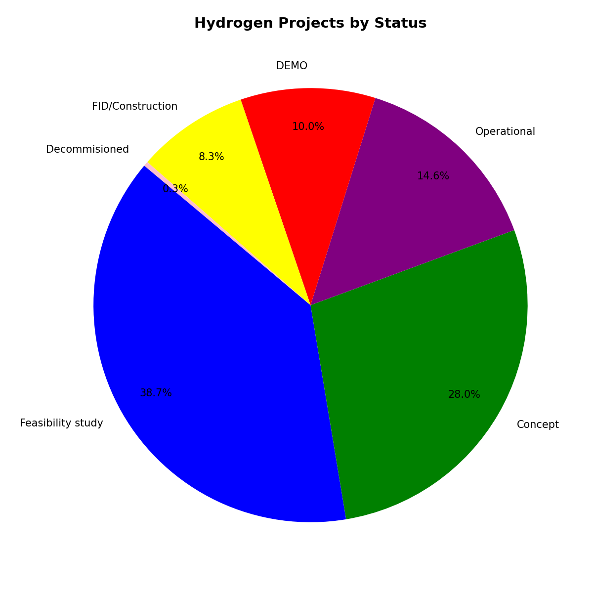
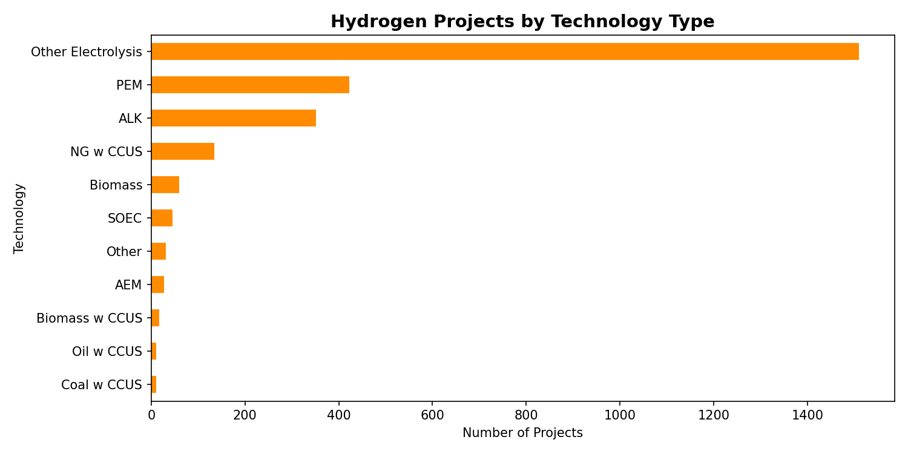
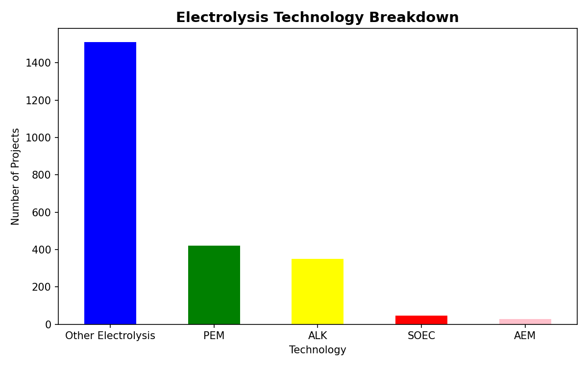

# Hydrogen Economy Dataset Analysis

Exploratory data analysis of 2,600+ global hydrogen projects using the 
IEA Hydrogen Projects Database. The goal is to identify trends in project 
pipelines, technology adoption, and regional distribution of hydrogen 
infrastructure worldwide.

---

## Key Findings

- **2,619 projects** across 80+ countries analyzed
- **68% of projects** are still in Concept or Feasibility stage — the hydrogen economy is largely pre-commercial
- **2026–2030 is the critical window** — over 1,000 projects are expected to come online in this period
- **PEM and ALK electrolysis** dominate clean hydrogen production at 54% of electrolysis projects combined
- **Europe and Asia-Pacific** lead in project count; large-scale export projects dominate Australia and Middle East

---

## Visualizations

### Top 15 Countries by Project Count

### Project Pipeline by Year (2015–2035)

### Project Status Breakdown

### Technology Breakdown

### Electrolysis Technologies

---

## Project Structure

hydrogen-analysis/

├── data/

│   ├── raw/                  # Original IEA dataset (not tracked in git)

│   └── processed/            # Cleaned CSV output

├── notebooks/

│   ├── 01_data_cleaning.ipynb

│   ├── 02_exploratory_analysis.ipynb

│   └── 03_visualizations.ipynb

├── outputs/

│   └── figures/              # All saved charts

├── requirements.txt

└── README.md

## Tools & Libraries

- Python 3.12
- pandas — data cleaning and analysis
- matplotlib — visualizations
- Jupyter — interactive notebooks

## Data Source

[IEA Hydrogen Projects Database](https://www.iea.org/data-and-statistics/data-product/hydrogen-production-and-infrastructure-projects-database)

---

## About

This project is part of my data analytics portfolio, combining my background 
in process engineering and clean energy with Python-based data analysis. 
I am pursuing an MSc in Clean Energy Processes at FAU Erlangen-Nürnberg, 
with a focus on hydrogen systems and electrolysis technologies.
